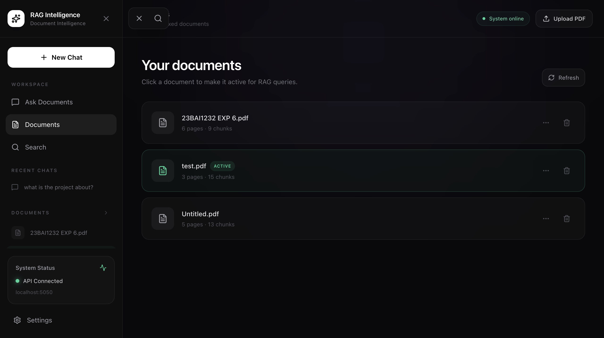
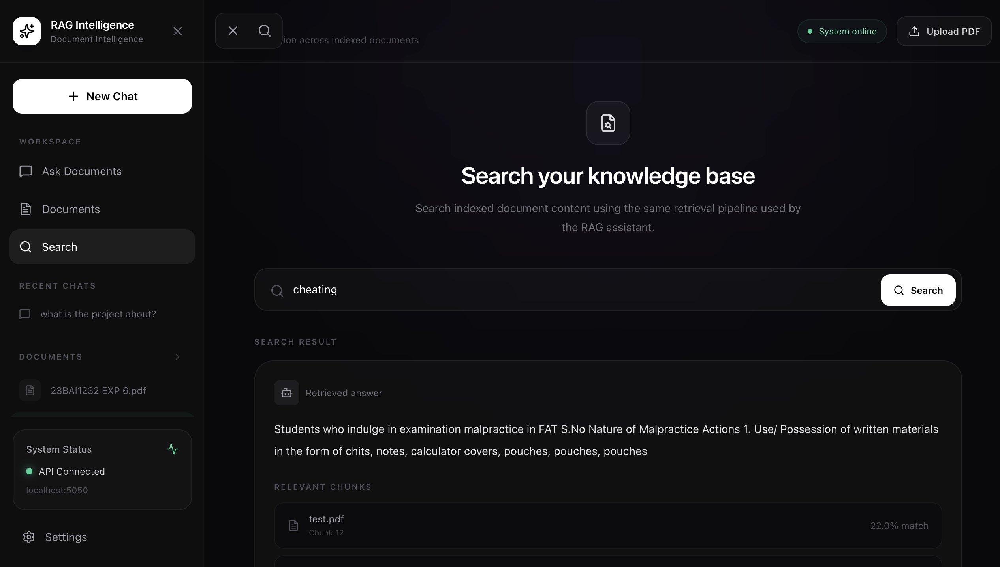

# RAG Intelligence: AI Powered PDF Document Intelligence & Retrieval-Augmented Generation

[](https://ragpdf-frontend.onrender.com/)
[](https://react.dev/)
[](https://nodejs.org/)
[](https://www.postgresql.org/)
[](https://ai.google.dev/)
[](https://redis.io/)

**Live Application:**  
https://ragpdf-frontend.onrender.com/

RAG Intelligence is a full-stack AI document intelligence platform that combines **Retrieval-Augmented Generation (RAG)**, semantic vector search, keyword retrieval, document chunking, embeddings, and Gemini-powered answer generation.

The system allows users to upload PDF documents, index their content, search across the document knowledge base, and ask natural-language questions while keeping responses grounded in the selected document.

> An AI-powered document intelligence system that transforms static PDFs into interactive conversational knowledge bases.

---

## Dashboard

### Document Workspace


### Conversational Document Q&A


### Document Management



### Semantic Search



### PDF Upload & Processing


---

## Architecture

```text
                    PDF Document
                         |
                         v
                  PDF Text Extraction
                         |
                         v
                    Text Chunking
                         |
                         v
                 Embedding Generation
                         |
                         v
                PostgreSQL + pgvector
                         |
                         |
User Question ----------+
                         |
                         v
                  Query Embedding
                         |
                         v
              +----------------------+
              |   Retrieval Layer    |
              |                      |
              | Semantic Retrieval   |
              | Keyword Retrieval    |
              | Topic Retrieval      |
              +----------+-----------+
                         |
                         v
                Reciprocal Rank Fusion
                         |
                         v
                 Relevant Chunks
                         |
                         v
                 Context Construction
                         |
                         v
                  Gemini Generation
                         |
                         v
              Grounded AI Response
                         |
                +--------+--------+
                |                 |
                v                 v
             Answer            Sources
````

## RAG Pipeline

```text
PDF Upload
     |
     v
Text Extraction
     |
     v
Document Chunking
     |
     v
384-Dimensional Embeddings
     |
     v
PostgreSQL + pgvector
     |
     v
User Question
     |
     v
Query Embedding
     |
     +------------------------+
     |                        |
     v                        v
Semantic Search         Keyword Search
     |                        |
     +------------+-----------+
                  |
                  v
        Reciprocal Rank Fusion
                  |
                  v
          Relevant Context
                  |
                  v
             Gemini LLM
                  |
                  v
        Grounded Response
                  |
                  v
          Answer + Sources
```

## Key Capabilities

PDF Document Processing

Users can upload PDF documents which are processed into searchable document chunks.

The processing pipeline performs:

PDF text extraction
Document chunking
Embedding generation
Vector storage
Metadata storage

Semantic Retrieval

The system uses vector embeddings to retrieve semantically relevant document chunks.

Embedding model:

`Xenova/all-MiniLM-L6-v2`

Embedding dimension:

`384`

The semantic retrieval layer allows questions to match conceptually related content even when the wording differs.

Keyword Retrieval

A keyword-based retrieval layer complements semantic search by identifying important lexical matches within the selected document.

This helps retrieve exact terminology, technical names, and phrases that may not receive the highest semantic similarity score.

Reciprocal Rank Fusion

Multiple retrieval rankings are combined using Reciprocal Rank Fusion to improve the final ordering of relevant chunks.

```text
Semantic Retrieval
        +
Keyword Retrieval
        +
Additional Retrieval Signals
        |
        v
Reciprocal Rank Fusion
        |
        v
Final Ranked Context
```

Document-Grounded Question Answering

The system associates each question with a selected PDF document.

The retrieval process searches the selected document and passes the most relevant chunks to Gemini before generating the answer.

This prevents unrelated indexed documents from being treated as factual context for the current question.

When the requested information cannot be supported by the selected document, the system can return:

`I couldn't find that information in this document.`

Conversational Follow-Up Questions

RAG Intelligence supports contextual follow-up questions using recent conversation history.

Example:

```text
User:
What are the main technologies?

Assistant:
React, Node.js, PostgreSQL...

User:
Which one was used for the frontend?

Assistant:
...
```

Conversation history is used to understand references and follow-up intent while the selected document remains the primary factual source.

Document Management

The application provides a dedicated document workspace where users can:

View indexed documents
Select an active document
Rename documents
Delete documents
View document metadata

Semantic Search

The Search workspace uses the retrieval infrastructure to find relevant information from indexed document content.

Users can search the knowledge base without manually navigating through PDF pages.

Source Transparency

RAG responses return retrieved source information alongside the generated answer.

The interface displays:

Source filename
Chunk index
Similarity / match score

This makes the retrieval process more transparent and helps users understand where an answer came from.

## Gemini Answer Generation

The final generation layer uses the Gemini API to transform retrieved document context into a natural-language response.

The model is instructed to:

Use the selected document as the factual source
Avoid unsupported external information
Use conversation history only for contextual understanding
Provide concise and natural responses
Return a document-grounded fallback when information is unavailable

## Technology Stack

### Frontend

React

Vite

Tailwind CSS

Lucide React

JavaScript / JSX

### Backend

Node.js

Express.js

CORS

Multer

dotenv

### AI & Retrieval

Gemini API

Retrieval-Augmented Generation

Xenova/all-MiniLM-L6-v2

Vector Embeddings

Semantic Retrieval

Keyword Retrieval

Reciprocal Rank Fusion

### Database

PostgreSQL 17

pgvector

### Infrastructure

Redis

Render Key Value

### Deployment

GitHub

Render Static Site

Render Web Service

Render PostgreSQL

Render Key Value
